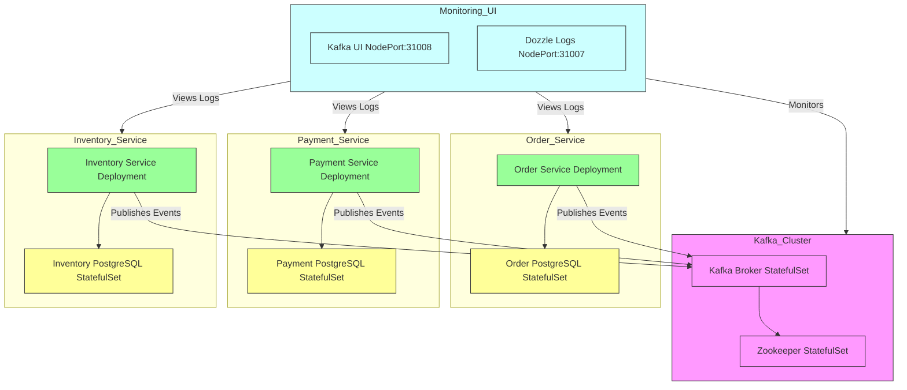

# 🐘 Order Processing System on Kubernetes

This project contains a fully containerized, Kubernetes-based **Order Processing System** composed of three microservices (`Order`, `Payment`, `Inventory`) backed by PostgreSQL and Kafka. It also includes observability via **Kafka UI** and **Dozzle**.

## 🧱 Architecture

## ⚙️ Components

- **Kafka & Zookeeper**: Messaging backbone for the microservices.
- **Kafka UI**: Inspect topics, consumers, messages.
- **Dozzle**: Real-time log viewer for Kubernetes pods.
- **PostgreSQL**: Each service has its own database.

## 🛠️ Namespaces Used

- `order`
- `payment`
- `inventory`
- `kafka`

## 📊 Observability

- **Dozzle**: Streams logs across services.
- **Kafka UI**: Monitor Kafka health, topics, and message flow.
